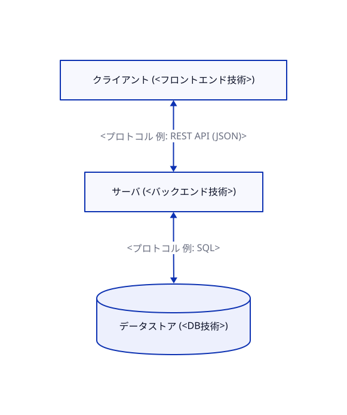

# ARCHITECTURE.md

> システム境界・依存ルール・設計パターンを定義する。

## システム全体構成

【要記入】構成図を D2 で書く（書き方は `DEVELOPMENT_RULES.md` の「図の書き方」参照）。以下は記入例。



ソース: `docs/diagrams/src/system.d2`

## コンポーネント構成

### フロントエンド (`frontend/`)

- 【要記入】フレームワーク・開発サーバURL・役割

### バックエンド (`backend/`)

- 【要記入】フレームワーク・ベースURL・ディレクトリ/アプリ構成

### データベース

- 【要記入】種類・接続情報の管理方法（環境変数名のみ記載し、値は書かない）

## URL設計方針

| パスプレフィックス | 担当 | 用途 |
|---|---|---|
| 【要記入】`/api/` | バックエンド | 例: REST API |

## 主要なデータフロー

> 重要な処理の流れを1つずつ図示する。

### 【要記入】フロー名

```
クライアント → <リクエスト>
           → <処理1>
           → <処理2>
           ← <レスポンス>
```

## 依存関係のルール

> 以下は例。プロジェクトに合わせて編集する。

- フロントエンドはバックエンドAPIにのみ依存する（DBへの直接アクセス禁止）
- ビジネスロジックはコントローラ/Viewに直接書かず、モデルやサービス層に分離する
- 環境ごとの差異は設定ファイルと環境変数で吸収する

## CORS設定（Web APIの場合）

- 開発環境: 【要記入】許可するオリジン
- 本番環境: デプロイ先ドメインのみ許可（ワイルドカード禁止）
